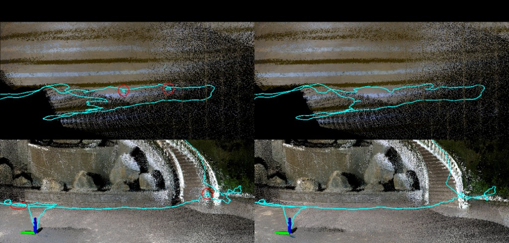

# SC_FAST_LIVO2



Tightly coupled **LiDAR–inertial–visual odometry** built on [**FAST-LIVO2**](https://github.com/hku-mars/FAST-LIVO2), extended with a **pose-graph optimization (PGO) hook**: the front end keeps the FAST-LIVO2 EKF estimate while loop-closure results are fed back over ROS for state correction and optional local map rebuild. **SC** is intended to be used together with **Scan Context**-style place recognition (actual loop detection and factor-graph solving live in an external PGO package).

> **Publication:** Add your title, venue, and arXiv/DOI here when available.

---

## Features

- **FAST-LIVO2 front end:** direct VO + voxel-map LiDAR + IMU; Livox and spinning LiDAR configs supported.
- **PGO integration:** subscribes to optimized keyframe poses/IDs; periodically updates the filter state and can rebuild the local map.
- **Dataset launches:** AVIA, NTU VIRAL, HILTI 2022, MARS LVIG, and more under `launch/`.
- **Scripts:** meshing and COLMAP export helpers in `scripts/` (optional, environment-dependent).

---

## Requirements

| Item | Suggested |
|------|-----------|
| ROS | **ROS Noetic** (Ubuntu 20.04) or another ROS1 distro you validate |
| C++ | C++17 |
| Libraries | Eigen3, PCL, OpenCV, Boost (thread), OpenMP optional |

---

## Dependencies

Catkin package name: **`fast_livo`** (see `CMakeLists.txt` / `package.xml`).

**ROS / catkin (install or clone into the same workspace):**

- `roscpp`, `sensor_msgs`, `geometry_msgs`, `nav_msgs`, `tf`, `tf2`, `tf2_ros`
- `image_transport`, `cv_bridge`, `pcl_ros`
- **`vikit_common`**, **`vikit_ros`**
- `livox_ros_driver` when using Livox hardware/drivers

**Full loop closure (optional):**

- `mapping_with_pgo.launch` includes `aloam_velodyne`'s `fastlivo2_pgo.launch`. Build that package in your workspace or run your own PGO/back-end nodes with matching topic names.

---

## Build

```bash
# Clone into ~/catkin_ws/src as fast_livo so roslaunch finds the package
cd ~/catkin_ws/src
git clone <YOUR_REPO_URL> fast_livo
cd ~/catkin_ws
rosdep install --from-paths src --ignore-src -r -y  # if applicable
catkin_make -DCMAKE_BUILD_TYPE=Release
source devel/setup.bash
```

---

## Run

### FAST-LIVO2 only (default: AVIA + pinhole camera)

```bash
roslaunch fast_livo mapping_avia.launch
```

### FAST-LIVO2 + PGO (requires e.g. `aloam_velodyne`)

```bash
roslaunch fast_livo mapping_with_pgo.launch
```

### Other example launches

| Launch file | Purpose |
|-------------|---------|
| `mapping_avia.launch` | Livox AVIA + `config/avia.yaml` |
| `mapping_avia_direct.launch` | AVIA variant |
| `mapping_avia_marslvig.launch` | MARS LVIG |
| `mapping_hesaixt32_hilti22.launch` | HILTI 2022 |
| `mapping_ouster_ntu.launch` | NTU VIRAL (Ouster) |
| `mapping_with_pgo.launch` | Front end + `fastlivo2_pgo.launch` + RViz |

Edit topic names and extrinsics in `config/*.yaml` for your bag or robot.

---

## ROS interface (PGO)

| Direction | Topic / note |
|-----------|----------------|
| **Publish** | `/cloud_registered_local` (`sensor_msgs/PointCloud2`, `frame_id`: `camera_init`) |
| **Subscribe** | `/aft_pgo_path` (`nav_msgs/Path`) — optimized keyframe poses |
| **Subscribe** | `/key_frames_ids` (`std_msgs/Header`, keyframe id in `seq`) |

Environment variable **`SC_FASTLIVO2`** is set in `mapping_avia.launch` to this package's path for external nodes.

---

## Parameters (`pgo` in `config/*.yaml`)

Additional parameters are read in `LIVMapper` (defaults in code if omitted):

- `pgo_integration_enable`, `pgo_update_frequency`, `pgo_state_update_enable`, `pgo_map_rebuild_enable`
- `pgo_update_weight`, `pgo_cov_weight`
- `max_keyframe_num`, `keyframe_meter_gap`, `keyframe_deg_gap`, `surrounding_search_radius`

See `readParameters` and PGO callbacks in `include/LIVMapper.h` and `src/LIVMapper.cpp`.

---

## Repository layout

```
fast_livo/
├── CMakeLists.txt
├── package.xml
├── assets/
├── config/
├── include/
├── launch/
├── rviz_cfg/
├── scripts/
└── src/
```

---

## Acknowledgements

Built on [**FAST-LIVO2**](https://github.com/hku-mars/FAST-LIVO2). Please cite the original work; if you publish derivatives, describe your PGO/back-end changes clearly.

---

## License

This project is licensed under the [**GNU GPLv2**](http://www.gnu.org/licenses/gpl-2.0.html); see [`LICENSE`](LICENSE). Maintainer metadata in `package.xml` may follow upstream templates; the `LICENSE` file prevails.
